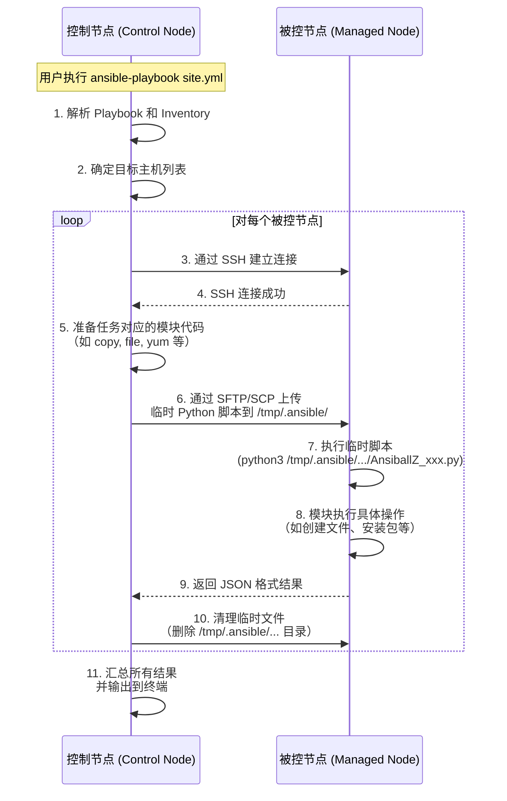

# 工作流程

### 🔍 流程关键点说明：
1. **无代理架构**：被控节点无需安装 Ansible，只需有 Python 和 SSH 服务。
2. **临时脚本**：Ansible 不会传输整个 Playbook，而是为每个任务动态生成一个独立的 Python 脚本。
3. **安全清理**：任务完成后，Ansible 默认会自动删除远程主机上的临时文件。
4. **基于 SSH**：所有通信（命令、文件传输、结果返回）都通过加密的 SSH 通道完成。
5. **JSON 通信**：模块执行结果以标准化的 JSON 格式返回，便于控制节点解析。
# 一、Inventory
实验环境
- Ansible-controller
- Ansible-node1
- Ansible-node2
## 密码认证
```ini
# group variable : 划分组别
[group_name]
Ansible-node1 

[group_name:vars]
ansible_connection=ssh 
ansible_user=<user> 
ansible_ssh_password=<passwd>

[web1]
# Ansible-node[开始：结束： 步长]
# Ansible-node[1:3]
# Ansible-node1
# Ansible-node2
# Ansible-node3


```

---

# 二、playbook
```yaml
# playbook.yml
- hosts: webservers
  remote_user: root
  tasks:
    - name: ensure apache is at the latest version
      yum:
        name: httpd
        state: latest
    - name: write the apache config file
      template:
        src: /srv/httpd.j2
        dest: /etc/httpd.conf

- hosts: databases
  remote_user: root
  tasks:
    - name: ensure postgresql is at the latest version
      yum:
        name: postgresql
        state: latest
    - name: ensure that postgresql is started
      service:
        name: postgresql
        state: started
```
### 说明：

1. **第一部分**（`webservers` 主机）：
    - 使用 `yum` 安装或更新 `httpd`（Apache HTTP Server）到最新版本。
    - 使用 `template` 模块将 `/srv/httpd.j2` 模板文件复制到目标服务器的 `/etc/httpd.conf`，用于配置 Apache。
2. **第二部分**（`databases` 主机）：
    - 使用 `yum` 安装或更新 `postgresql` 到最新版本。
    - 使用 `service` 模块确保 PostgreSQL 服务处于运行状态。
    

---

# 三、Module
## 3.1 变量(variable)
```yaml
- name: Hello world
  hosts: localhost
# 定义变量
  [vars:]{优先级最**低**}
	greeting: "hello from playbook vars"
	demo:
		a: 
		- a: 1
		- b: 2
		b: test
		
# 引入单独的配置文件
  [vars_files:]{优先级最**高**,且多个文件定义同一个变量时,**后面取代前面**的}
    - "vars/demo.yml"
      
  tasks:
  - name: hello world debug
	debug:
	# `demo`变量的引用
	msg: "{{demo}}"
```

```yaml
# vars/demo.yml
demo:
 a: 
 - a: 1
 - b: 2
b: test

```
## 3.1.1 循环(loop)
```yaml
---
- hosts: localhost
  gather_facts: no

  vars:
    test:
    - test1
    - test2
    - test3
    - test4

  tasks:
  - name: Test loop
    debug:
      msg: "{{ [item]{关键字,**被with_items调用**} }}"
    with_items: "{{ [test]{可以**遍历**的变量} }}"
```
### 嵌套(nest)
```yaml
---
- hosts: localhost
  gather_facts: no

  vars:
    test:
    - test1
    - test2
    - test3
    - test4
    demo:
    - test1
    - test2
    - test3
    - test4

  tasks:
  - name: Test loop
    debug:
	  msg: "{{ item[0] }}, {{ item[1]}} "
	with_nested:
	  - "{{ test }}"
	  - "{{ demo }}" 
```
## 3.1.2 Group 和 host 变量
### 源文件
```ini
[all]
host1 ansible_user=vagrant ansible_password=vagrant ansible_connection=ssh
host2 ansible_user=vagrant ansible_password=vagrant ansible_connection=ssh
```
###  单文件管理
```ini
[all]
host1
host2 [http_port = 443]{host variable}

[all:vars]
# group variable; `all` 组所有主机共享
ansible_user=vagrant
ansible_password=vagrant
ansible_connection=ssh
http_port = 80
```
> [!note] 优先级
> host 高于 group 的优先级

### 结构化管理
目录结构
```
inventory/
├── hosts.ini
├── ansible.cfg
├── group_vars/
│   └── all.yaml
└── host_vars/
    ├── host1.yaml
    └── host2.yaml
```
配置文件
```ini
# hosts.ini
[all]
host1
host2

```
```yaml
# group_vars/all.yaml
# 自动找到 `group_vars` 目录中,对应[组]{}名的文件获取配置
ansible_user: vagrant
ansible_password: vagrant
ansible_connection: ssh
http_port:  80

```
```yaml
# host_vars/host2.yaml
# 自动找到 `host_vars` 目录中,对应[主机]{}名的文件获取配置
host_port: 443
```

## 3.2 条件判断(when)
### and
```yaml
---
- hosts: localhost
  gather_facts: no
  vars:
    env: prod
    debug_mode: false

  tasks:
    - name: Only run in production AND when debug is off
      debug:
        msg: "Running in secure production mode"
      when: env == "prod" and debug_mode == false
```
✅ 只有当 `env` 是 `"prod"` **并且** `debug_mode` 是 `false` 时，任务才会执行。
### or
```yaml
---
- hosts: localhost
  gather_facts: no
  vars:
    user_role: admin

  tasks:
    - name: Allow access for admin or operator
      debug:
        msg: "Access granted to {{ user_role }}"
      when: user_role == "admin" or user_role == "operator"
```
✅ 如果 `user_role` 是 `"admin"` **或** `"operator"`，任务就会运行。


---
# 四、Blocks
block & rescue
```yaml
---
- name: learn block
  host: all
  become: yes
  
  tasks:
    block:
      - name: debug before task failed
        debug:
         msg: "I execute normally"
      - name: failure
        command: /bin/tests
    # 除非 `block` 中有失败, 否则 `rescue` 不执行
    rescue:
      - name: test rescue
        debug:
          msg: " I never execute. as above task is failing..."
          
    # 无论如何都要执行
     always:
       - name: always debug
         debug:
           msg: "this always executes"
          
```
> [!attention] 注意
> 默认是纯线性执行的,既`A--> B --> C` B失败了, C 就不执行

---

# 五、command
```shell
# Inventory
ansible < all | group_name | node >  -m ping -i inventory.ini [--private-key=<path/to/private_key>]{inventory.ini文件==没有==**ansible_pass**字段}

# 语法校验
ansible-playbook --syntax-check site.yaml

# playbook
ansible-ploybook playbook.yml -i Inventory.ini --private-key=private_key

# 执行命令
ansible all -m shell -a "<shell command>"
eg
ansible all -m shell -a "cat /etc/os-release"
eg
ansible all -m gather_facts [--tree ./facts]{将获取到的信息保存到facts目录中，每个主机一个主机文件}
 
```

---

# 单词
invent ： 发明
inventory ： 库存
playbook : 剧本
module : 模块
recap : 回顾
variable : 变量
orchestration : 编制
reachable : 可获得的
unreachable : 遥不可及的
nest : 嵌套
when : 当,什么时候
gather : 收集
facts : 事实
block ： 块
rescue ： 救援